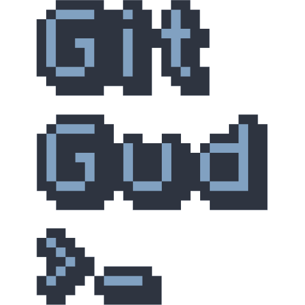
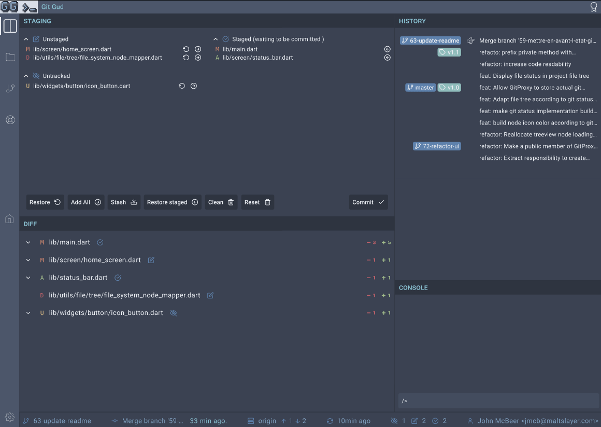
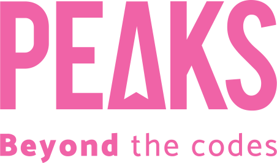

<div align="center">

  <a href=""></a>

  **A didactic and transparent GUI for Git using Gamification**

  <a href="#key-features">Key Features</a> •
  <a href="#how-to-install">How To Install</a> •
  <a href="#roadmap">Roadmap</a> •
  <a href="#how-to-contribute">How to contribute</a> •
  <a href="#troubleshooting">Troubleshooting</a>

  <a href="https://project.peaks.fr/peaks-ri/git-ihm/-/pipelines"></a>
  <a href=""></a>
  <a href=""></a>
  <a href="code_of_conduct.md"></a>

  
</div>
<br><br>

# Table of contents

[TOC]

# Ambition

This project aims to develop a comprehensive graphical interface for Git that consistently let the user know what is really happening.

To accomplish this, the interface will blend the simplicity offered by Git GUIs with the control ensured by the command line.

Gamification is employed to guide users and ensure they gain a thorough understanding of how Git works.

# Key Features

> :construction: This project is under construction, those feature are planned as a MVP version

- [ ] **Create a new Git project**
- [ ] **Visualize staging area and diffs**
- [ ] **Visualize Git History**
- [ ] **Add and Restore, Stash, Commit modifications**
- [ ] **Fetch and Push branches**
- [ ] **Visualize commit details**

# How To Install

## Prerequisite

- [Flutter (>=2.2)](https://flutter.dev/docs/get-started/install) installed
- [Flutter Desktop](https://flutter.dev/desktop) enabled

```bash
flutter config --enable-windows-desktop
flutter config --enable-macos-desktop
flutter config --enable-linux-desktop
```

> Additional steps for Windows
>
> ```bash
> flutter channel dev
> flutter upgrade
> flutter config --enable-windows-uwp-desktop
> ```

## Build from sources

1. `git clone git@git.peaks.fr:peaks-ri/git-ihm.git` *clone the project*
2. `flutter pub get` *download dependencies*
3. `flutter devices` *list devices, ensure your OS is available*
4. `flutter run -d <device>` *run the project on \<device>, linux, windows or macos*

**:thumbsup: You are Ready to Go!**

# Gamification

<details>
<summary><h4>Color codes</h4></summary>

> Coming soon...

</details>

<details>
<summary><h4>Impact zone highlighting</h4></summary>

> Coming soon...

</details>

<details>
<summary><h4>Long press confirmation</h4></summary>

> Coming soon...

</details>

<details>
<summary><h4>Sandbox area</h4></summary>

> Coming soon...

</details>

<details>
<summary><h4>Progression tracker</h4></summary>

> Coming soon...

</details>

# Roadmap

## MVP

- [ ] Create a new Git Project
- [ ] Display working tree state
- [ ] Display current diff (staged & modified)
- [ ] Display commits log (list version)
- [ ] Add & Restore
- [ ] Commit
- [ ] Fetch, Rebase & Push
- [ ] Create new branches

# Contributors

- Jules Chevalier
- Sami Sheikh
- Nathanael Schmitt
- Ludovic Reus
- Mégane Foussa
- Thibault Rousset
- Noémie Allouche

# How to contribute

1. Clone the project

   ```bash
   git clone git@git.peaks.fr:peaks-ri/git-ihm.git
   ```

2. Enable project specific git hooks

   ```bash
   cd git-ihm/
   git config core.hooksPath .githooks
   ```

3. Choose your issue from the [project's board](https://project.peaks.fr/peaks-ri/git-ihm/-/boards)
4. Create a Merge Request from the issue (and get the branch name)
5. Resolve the issue following the [Developer's guide](https://project.peaks.fr/peaks-ri/charte-projets-ri)
6. Push your code on the corresponding branch

   ```bash
   git switch -c <issue-number>-<issue-name>
   git commit
   git push
   ```

7. Submit your Merge Request !

## Directory Structure

- `lib/`
  - `screen/` contains all *screens*, *i.e.* all widgets that are displayed on their own on the screen (not included in another widget)
  - `widget/` contains all project custom widgets
    - `button/`
  - `utils/` miscellaneous classes for utility methods
  - `git/` lib to access the git layer
- `assets/`
  - `fonts/`
- `test/`
  - `test_repository` empty folder, can be used as repository folder for tests
  
## Application Structure

In order to keep the application code maintainable we decided to separate the code dedicated to print
the User Interface (Widgets) from the code interacting with the Git application. This allows us to
separate the code as if we were having a Front-End manipulating a library. It does even more by making
our "library" available from any Widget context.

This was achieved with the InheritedWidget technology made easier with the package [Provider](https://pub.dev/packages/provider).
The GitProxy abstract class defines a facade injected in the Flutter framework thanks to the
ChangeNotifierProvider Widget. Every widget is now able to interact with GitProxy thanks to Consumer
and Provider widgets. See [the official Flutter state management documentation](https://docs.flutter.dev/development/data-and-backend/state-mgmt/simple)
to learn more about these Widgets.

## Project commands

- `make test` will run all unit and component tests located in /test directory
- `make clean` will analyze and format your code to keep it to the upper standards

## Tests based on git command results

As the project need to execute commands with Git and adapt their results it is
essential to be able to test project elements fulfilling this purpose.
Test tagged with `file-system-dependent` are expected to run on an isolated environment
of the file system created by the script [git_interpreter_fixtures.sh](test/scripts/git_interpreter_fixtures.sh)
located in `/tmp` directory on linux and macOS systems.

## Testing Consumer and Provider widgets

Class [GitDependentLoader](test/git_dependent_loader.dart) provides a simple way to load any widget
in a test application: It will provide in its context an instance of GitProxy as a ChangeNotifier.
You just need to instantiate the tested widget and pass it to GitDependentLoader.

```dart
// import flutter_test and git_dependent_loader.

testWidgets('my git dependent test', (WidgetTester tester) async {
  final GitDependentLoader loader = GitDependentLoader();
  final Widget app = loader.loadAppWithWidget(const MyTestedWidget());
```

If no GitProxy is provided, loader will provide a new instance of [GitProxyMock](test/mock/git_proxy_mock.dart)
but you may also pass a reference to your own GitProxy to manipulate it in your test.

```dart
  final GitProxy git = GitProxyMock();
  final Widget app = loader.loadAppWithWidget(const MyTestedWidget(), git);

```

You will then be able to "pump" application and test your widget's behavior.

```dart
  await tester.pumpWidget(app);

  // Do your tests
  // expect(..., ...);
});
```

## Integration tests

Directory integration_test contains tests that are not triggered with th command `make test`for
performance purpose. See [flutter integration test documentation](https://docs.flutter.dev/cookbook/testing/integration/introduction)
to learn more on them. They can be launched with the command:
`flutter test integration_test/[your-integration-test].dart`

# License



(c) Copyright 2021 [PEAKS](https://peaks.fr/), all rights reserved.

# Troubleshooting

## CMake error on flutter run

If you encounter a C++ compiler error when running `flutter -d linux` command, try to update your C++  
related packages, then clear the build and .dart_tool directories:

```bash
sudo apt-get install clang cmake ninja-build pkg-config libgtk-3-dev  
flutter clean
```
